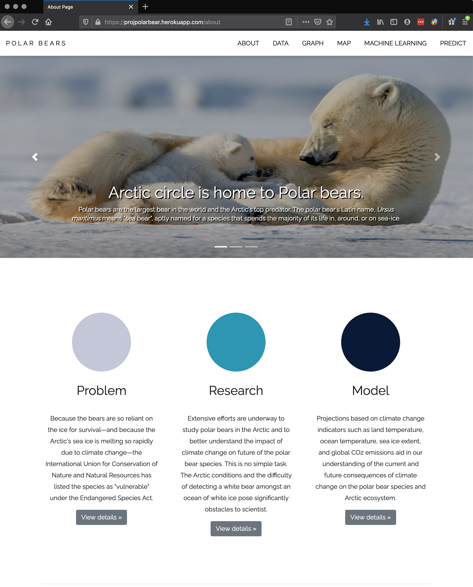
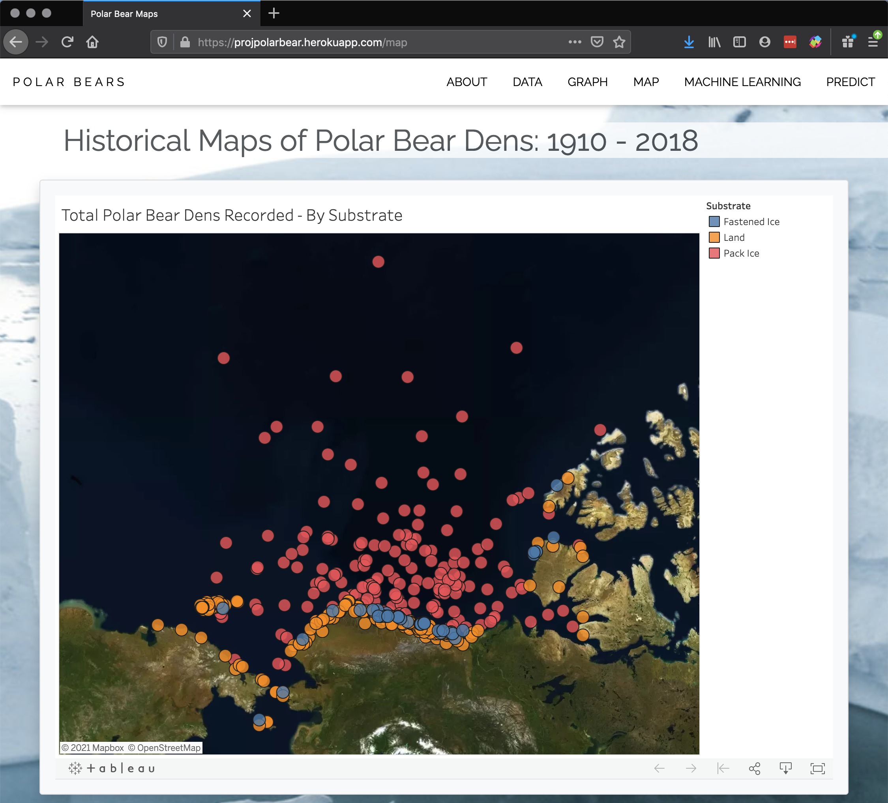
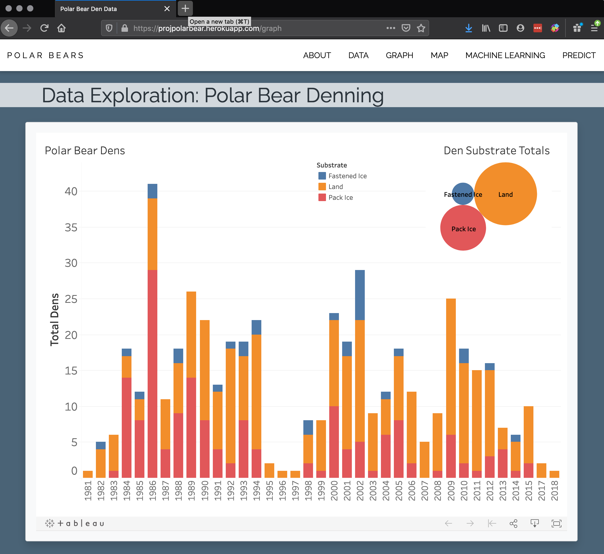
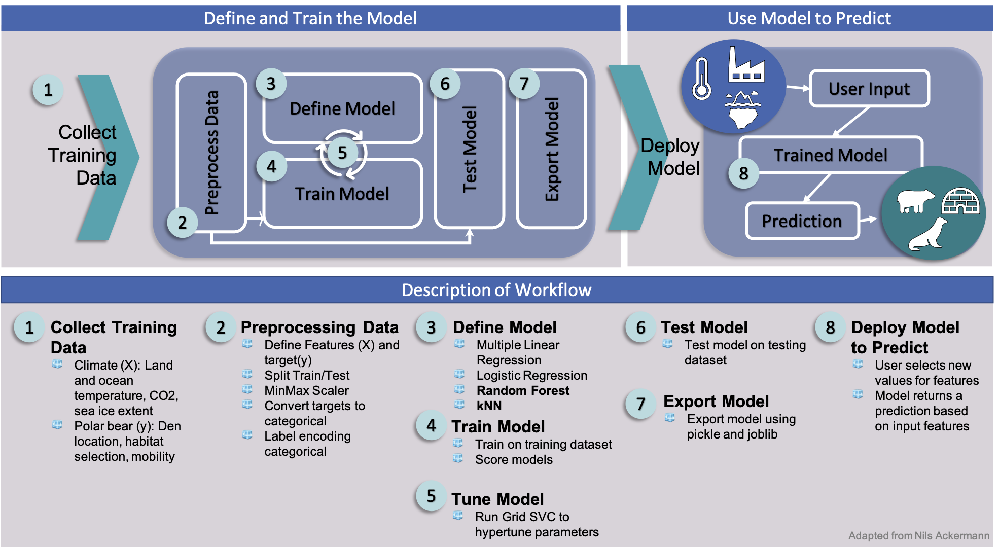

# Emerging Trends: Climate Change Impact on Polar Bears

Collaborative project to showcase variety of skills mastered following a 6 month bootcamp in Data Analysis and Visualization at the University of Pennsvylania. Created a full-stack machine learning web application which provides essential information on climate, polar bear population, and identifys emerging trends where climate change intersects the Arctic polar bear species. 

Conducted data manipulation from 6 independent sources, trained unsupervised learning algorithms and clustering techniques on climate change metrics to predict polar bear mobility and habitat suitability.

##  Overview of Key Technologies
* **Python**: Flask, Pandas, Numpy, Sklearn, Math, Datetime, SqlAlchemy, Pickle, Jupyter Notebook, Google Colab
* **Database Management**: SQLite, pgAdmin, AWS R3, AWS RDS, PostGres
* **Web Development**: Javascript, D3.js, Vanilla, HTML, Bootstrap

 

# Table of Contents

- [App Architecture](#Architecture)
- [Visualizations](#Visualizations)
- [Machine Learning](#development)
- [Predict](#contribute)

 

# Architecture

## Creating Operation Polar Bear Database

1. Identify datasets and download CSV files
    Create an Relational Database using AWS RDS
2. Create Buckets to store the data and link to AWS RDS
3. Utilize Googles Colab import the Pyspark library to tranferr data from AWS S3 to AWS RDS Postgres DB
4. Access the AWS RDS using PGAdmin

[Code available at Google Colab](https://colab.research.google.com/gist/lilstarhunter/358ed454c43361c6cee5ead3b23eccea/polarbeardatabase.ipynb) 

## App Wireframe
The ground work for the web application was layed using flask, Python, Javascript, HTML.

**About**: Learn about polar bears and risk climate change imposes on long term survival of the species.

**Data**: Links to the data sources and allows users to interact with the data tables.

**Graph & Map**: Tableau generated visualizations of polar bear data sets across time.

**Machine**: Overview of the machine learning workflow and links to the google colab documents

**Predict**: User interactive sliders to visualize how changes in climate metrics impact polar bear behavior.

 

# Visualizations 
Data visualizations, such as maps and charts, were created using Tableau public and imported into application. D3.js used for data table import and interaction.

Arctic Circle Maps            |  Polar Bear Trends
:-------------------------:|:-------------------------:
  |  

# Machine Learning

The ML was done with Sklearn,Pandas,Numpy, and Pickle Python libraries, Jupyter Notebook used to graphically analyze the data. The results from this analyzes was exported to the frontend of the application using javascript.

 

# Predict

Users interact with sliders to adjust Land and Ocean Temperature, Global CO2 emissions, and Sea Ice Extent to predict 
1. Suitablility of Polar Bear Habitat
2. Polar Bear Mobility
3. Maternal Den Location

(https://youtu.be/Y74U1o0uQ6E)
