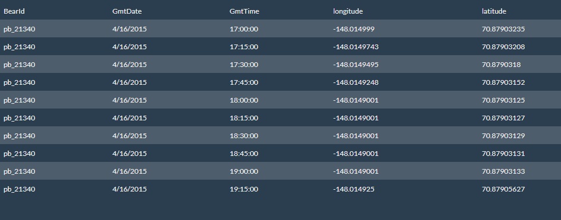
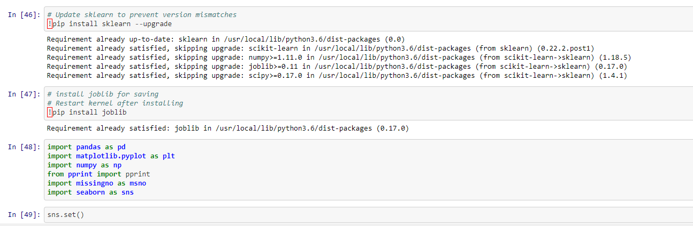

# Emerging Trends: Climate Change Impact on Polar Bears

Collaborative project to showcase variety of skills mastered following a 6 month bootcamp in Data Analysis and Visualization at the University of Pennsvylania. Created a full-stack machine learning web application which provides essential information on climate, polar bear population, and identifys emerging trends where climate change intersects the Arctic polar bear species. 

Conducted data manipulation from 6 independent sources, trained unsupervised learning algorithms and clustering techniques on climate change metrics to predict polar bear mobility and habitat suitability.

##  Overview of Key Technologies
* **Python**: Flask, Pandas, Numpy, Sklearn, Math, Datetime, SqlAlchemy, Pickle, Jupyter Notebook, Google Colab
* **Database Management**: SQLite, pgAdmin, AWS R3, AWS RDS, PostGres
* **Web Development**: Javascript, D3.js, Vanilla, HTML, Bootstrap

# Table of Contents

- [Architecture](#Architecture)
- [Machine Learning](#development)
    - [Adding to Chrome](#adding-to-chrome)
    - [Adding to Firefox](#adding-to-firefox)
- [Predict](#contribute)

# App Architecture

The architecture of the application was to use raw csv data file collected from various sources. Have those file sitting in a S3 bucket. The data was then cleaned and manipluated leveraging Jupyter Notebooks as well as Google Colab. Once cleaned and shaped it was sent to a AWS RDS database where the PGAdmin tool was used to create the needed tables, the data was then used by the Tableau analytics tool to create Maps and Graphs as well as used in the training of the Machine learning Model.

The ground work for the web application was layed using flask, Python, Javascript, HTML

The Map and Charting was done using the popular data analytics tool Tableau where it was set to the Tableau public could and then imported into the application.

The data was pull from the AWS RDS database using SqlAlchemy.

The data table was exported from the routes to the frontend using D3 js

# Machine Learning

The ML was done with Sklearn,Pandas,Numpy, and Pickle Python libraries, Jupyter Notebook used to graphically analyze the data. The results from this analyzes was exported to the frontend of the application using javascript.

# Predict

